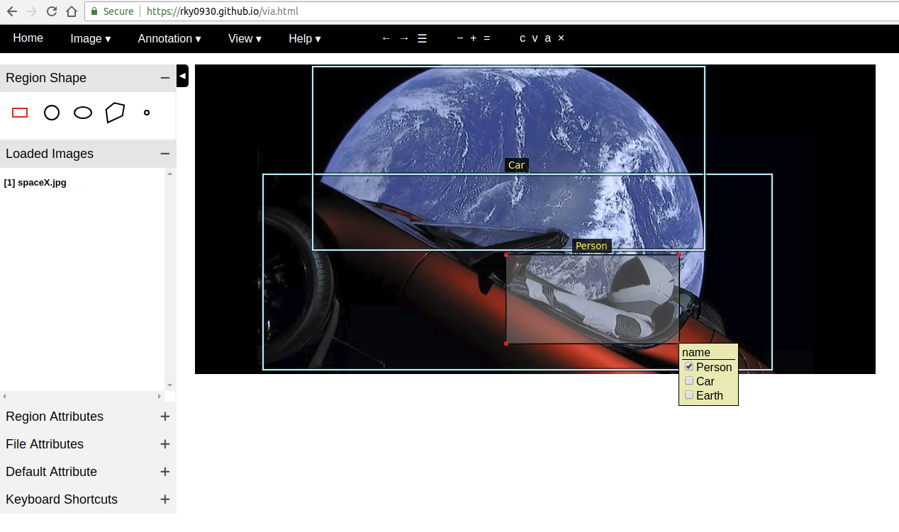

# Notice
The on-image annotation editor feature is added to original VIA since VIA 2.0.2 version.   
([based on my contribution](https://gitlab.com/vgg/via/blob/master/Contributors.md))  
If you want to use this version of VIA, I'd like to recommand you to use latest original VIA.  
The python scripts associated with tfrecord are still useful to users of VIA and Tensorflow. 


# VIA Annotation tool
[VGG Image Annotator (VIA)](http://www.robots.ox.ac.uk/~vgg/software/via/)is Image annotation tool.  
Original repo is [here](https://gitlab.com/vgg/via/tags/via-1.0.4).  

## New features in this version
1. On-image annotation editor 
2. Attribute setup text area
3. Python script to make VIA annotation file to tfrecord  
4. Python script to make tfrecord to VIA annotation file  
  
  

## Installation
1. Web Browser (All source code based on JS & HTML)  
2. (Optional) Python *Only if you want to create tfrecord  

## Usage example
1. Open via/via.html using web browser
2. Load Images 
3. Set default attribute
4. (If you have annotation file) Import Annotation file
5. Marking object(Bounding box, polygon, Etc)
6. Save Annotation file
7. (If you use tfrecord) Make tfrecord 

## Development setup
1. Dowdload Source code.  
2. (If you want to modify HTML) Modify index.html  
3. (If you want to modify JS) Modify via.js  
4. Mergeing index.html and via.js into target file
```sh
sh pack_via.sh
```
5. target file is via.html

## Author
Gyoung-yoon Ryoo – [rky0930@gmail.com]

## License
VIA is an open source project released under the 
BSD-2 clause license.

## Contributing

1. Fork it (<https://github.com/rky093/via/fork>)
2. Create your feature branch (`git checkout -b feature/fooBar`)
3. Commit your changes (`git commit -am 'Add some fooBar'`)
4. Push to the branch (`git push origin feature/fooBar`)
5. Create a new Pull Request

## Issue report 
1. Report via [issues page](https://github.com/rky0930/via/issues) in this repos. 
   
